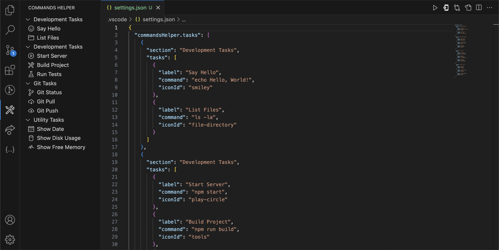

# Commands Helper

Commands Helper is a Visual Studio Code extension designed to streamline the development workflow by providing an easy way to manage and execute custom tasks directly from the VSCode interface.

## Features

- **Task Management**: Organize tasks into collapsible sections for better organization.
- **Custom Commands**: Run terminal commands with a single click.
- **Configurable**: Easily add or modify tasks through the workspace settings.

## Usage

### Adding Tasks

To add tasks, modify the `settings.json` file in .vscode folder inside your workspace. Here is an example configuration:

## Example Interface



Note: **iconId** supports VSCode Product Icons only. You can find the list of Icons from https://code.visualstudio.com/api/references/icons-in-labels

```json
{
  // ... Other Configurations

  "vscodeHelper.tasks": [
    {
      "section": "Basic Tasks",
      "tasks": [
        {
          "label": "Say Hello",
          "command": "echo Hello, World!",
          "iconId": "smiley"
        },
        {
          "label": "List Files",
          "command": "ls -la",
          "iconId": "file-directory"
        }
      ]
    },
    {
      "section": "Development Tasks",
      "tasks": [
        {
          "label": "Start Server",
          "command": "npm start",
          "iconId": "play-circle"
        },
        {
          "label": "Build Project",
          "command": "npm run build",
          "iconId": "tools"
        },
        {
          "label": "Run Tests",
          "command": "npm test",
          "iconId": "beaker"
        }
      ]
    },
    {
      "section": "Git Tasks",
      "tasks": [
        {
          "label": "Git Status",
          "command": "git status",
          "iconId": "source-control"
        },
        {
          "label": "Git Pull",
          "command": "git pull",
          "iconId": "cloud-download"
        },
        {
          "label": "Git Push",
          "command": "git push",
          "iconId": "cloud-upload"
        }
      ]
    },
    {
      "section": "Utility Tasks",
      "tasks": [
        {
          "label": "Show Date",
          "command": "date",
          "iconId": "calendar"
        },
        {
          "label": "Show Disk Usage",
          "command": "df -h",
          "iconId": "database"
        },
        {
          "label": "Show Free Memory",
          "command": "free -m",
          "iconId": "pulse"
        }
      ]
    }
  ]

  // ... Other Configurations
}
```

- **vscodeHelper.tasks**: Root key containing an array of task sections.
- **section**: Defines a collapsible section name grouping related tasks.
- **tasks**: Array of task objects within a section.
- **label**: The name of the task as it will appear in VSCode.
- **command**: The terminal command to be executed when the task is run.
- **iconId**: The icon displayed alongside the task label in VSCode.

<a href="https://www.flaticon.com/free-icons/gear" title="gear icons">Gear icons created by Eucalyp - Flaticon</a>